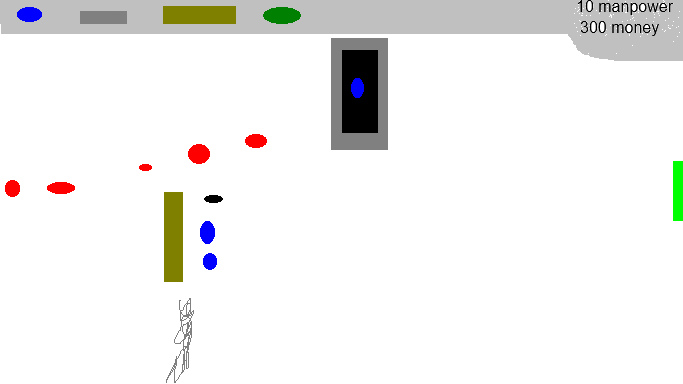

# Controls
Left Click to place or upgrade towers\
Spacebar to spawn wave

# Sprint 0 - Game Design Document : Tower Defense

Naam: Jeffrey

Klas: SD2A

Datum: 11/09/2025

## 1. Titel en elevator pitch

Titel: 

Een game in  WWII waar je meerdere waves van vijanden moet tegenhouden.

## 2. Wat maakt jouw tower defense uniek

De vijanden kunnen terug vechten en er is geen specifiek pad.

## 3. Schets van je level en UI

## 4. Torens

Infantry
range: 10
damage: 3
ability: none

Sniper
range: 30
damage: 12
ability: none

Eventuele extra torens:

## 5. Vijanden

Infantry
speed: medium
health: 5
ability: none

Fighter Plane
speed: medium-fast
health 3
ability: airborne

Officer
health: 50
ability: melee

## 6. Gameplay loop

Beschrijf in drie tot vijf stappen wat de speler steeds doet. 

    1. Plannen
    2. Plaats niewe towers
    3. Wacht voor geld

## 7. Progressie

Meer en sterker vijanden.

## 8. Risico’s en oplossingen volgens PIO

    Probleem 1: Enemies gaan niet dood.

    Impact: Groot

    Oplossing: Destroy(gameobject)

    Probleem 2: Je kan geen torens plaatsen.

    Impact: Groot

    Oplossing: Fix collision detection voor torens plaatsen.

    Probleem 3: Vijanden kunnen door torens bewegen.

    Impact: Groot

    Oplossing: Een flowfield voor navigatie gebruiken.

## 9. Planning per sprint en mechanics

Schrijf per sprint welke mechanics jij oplevert in de build. Denk aan voorbeelden zoals vijandbeweging over een pad, torens plaatsen, doel kiezen en schieten, waves starten, UI voor geld en levens, upgrades, jouw unieke feature.

Sprint 1 mechanics: UI

Sprint 2 mechanics: Torens plaatsen

Sprint 3 mechanics: Vijanden AI (Niet Generative AI)

Sprint 4 mechanics: Waves zetten

Sprint 5 mechanics: Maps Maken

## 10. Inspiratie

WWII

## 11. Technisch ontwerp mini

Lees dit korte voorbeeld en vul daarna jouw eigen keuzes in.

Voorbeeld ingevuld bij 11.1 Vijandbeweging over het pad

    Keuze: Vijanden volgen punten A, B, C en daarna de goal.
    Risico: Een vijand loopt een punt voorbij of blijft hangen.
    Oplossing: Als de vijand dichtbij genoeg is kiest hij het volgende punt. Bij de goal gaat één leven omlaag en verdwijnt de vijand.
    Acceptatie: Tien vijanden lopen van start naar de goal zonder vastlopers en verbruiken elk één leven. Alle tien vijanden bereiken achtereenvolgens elk waypoint binnen één seconde na elkaar.

11.1 Vijandbeweging over het pad

    Keuze: De vijanden bewegen niet op een specifieke pad.
    Risico: Vijanden kunnen door torens bewegen.
    Oplossing: Een flowfield voor navigatie gebruiken.
    Acceptatie: De vijanden lopen rond de torens naar de goal.

11.2 Doel kiezen en schieten

    Keuze: Torens kunnen kiezen voor meerdere manieren van kiezen.
    Risico: Torens kiezen de verkeerde vijanden.
    Oplossing: Torens houden een lijst van vijanden.
    Acceptatie: Torens schieten de eerste, laatste, dichtstbijzijnde of het verst weg.

11.3 Waves en spawnen

    Keuze: Vijanden spawnen in waves.
    Risico: Vijanden kunnen allemaal tegelijk spawnen.
    Oplossing: Cooroutines gebruiken voor timing.
    Acceptatie: Vijanden spawnen achter elkaar.

11.4 Economie en levens

    Keuze: Je gebruikt geld om torens te plaatsen.
    Risico: Je kan te veel geld krijgen.
    Oplossing: De game testen.
    Acceptatie: Je krijgt net genoeg geld om de vijanden te verslaan

11.5 UI basis

    Keuze: UI zit bovenaan.
    Risico: UI overzicht van de veld kleiner maken.
    Oplossing: Maak het veld kleiner.
    Acceptatie: Je kan het heele veld op scherm zien.
